# UX Design Specification accountapp

**Author:** Wilfriedhouinlindjonon
**Date:** 2026-01-07

---

## Executive Summary

### Project Vision

accountapp est une application mobile de gestion financière personnelle conçue pour les personnes à revenus modestes en Afrique francophone. La philosophie UX repose sur la **simplification radicale**: un seul nombre ("Reste à Vivre") répond à la question "Combien puis-je dépenser aujourd'hui?".

L'app transforme la gestion budgétaire passive (tableaux Excel, calculs mentaux) en un système actif qui:
- Met à jour le budget en temps réel après chaque transaction
- Révèle les patterns de dépenses invisibles après 30 jours
- Intègre les réalités financières africaines (tontines, obligations familiales)

### Target Users

**Persona Principal: Le Dev Full Stack (Wilfried)**
- 27 ans, 350,000 FCFA/mois, loyer 100,000 FCFA
- Problème: Emprunte à la famille en fin de mois malgré un salaire stable
- Comportement: Achats compulsifs, taxis au lieu de bus, commandes à domicile
- Besoin: Voir son argent disponible AVANT de dépenser

**Personas Secondaires:**
- L'Étudiant Fauché: Micro-dépenses invisibles, psychologie du "billet cassé"
- Le Jeune Actif (Premier Job): Pas d'habitudes financières, obligations familiales culturelles

**Caractéristiques Communes:**
- Tech-savvy mais pas experts financiers
- Utilisent des appareils Android low-end (Tecno, Infinix)
- Cash + Mobile Money (Wave, Orange Money)
- Français comme langue principale

### Key Design Challenges

1. **Single-Number Clarity**: Rendre un seul chiffre suffisamment informatif pour guider les décisions quotidiennes sans créer de surcharge cognitive

2. **Friction Minimale**: Saisie de transaction en <10 secondes pour encourager l'usage quotidien et maintenir les streaks

3. **Performance Low-End**: Cold start <3s, transitions <300ms sur appareils à 150 USD

4. **Tone of Voice Supportif**: Motiver et encourager sans jamais culpabiliser l'utilisateur pour ses dépenses

5. **Progressive Disclosure**: Cacher la complexité (patterns, stats) jusqu'au moment approprié (30 jours)

### Design Opportunities

1. **Budget Hero Card**: Élément visuel central avec feedback couleur émotionnel instantané

2. **Quick Add FAB**: Bouton flottant omniprésent pour saisie en 3 taps maximum

3. **Gamification Légère**: Streaks visuels et célébrations pour créer des habitudes positives

4. **Pattern Revelation**: "Moment aha" comme récompense après 30 jours de données

5. **Cultural Features**: Tontines et cotisations comme fonctionnalités natives, pas des adaptations

---

## Core User Experience

### Defining Experience

L'expérience core d'accountapp se résume en une boucle simple:

**Dépense → Saisie rapide (3 taps) → Budget mis à jour (<100ms) → Feedback couleur**

L'action critique est l'ajout de transaction. Si cette action est fluide, l'utilisateur reviendra quotidiennement. Si elle est frustrante, l'app sera abandonnée.

**Core Loop:**
1. Utilisateur ouvre l'app → voit son budget immédiatement
2. Utilisateur ajoute une dépense → 3 taps maximum
3. Budget se met à jour → feedback visuel instantané
4. Utilisateur ferme l'app → confiance dans son contrôle financier

### Platform Strategy

| Aspect | Decision | Rationale |
|--------|----------|-----------|
| Primary Platform | Android Mobile | 85%+ market share in target region |
| Input Mode | Touch-based | Smartphone-only, no desktop |
| Connectivity | 100% Offline | Unreliable network, expensive data |
| Background | WorkManager | Local notifications, streak tracking |
| Future | SMS parsing (v1.1) | Wave/Orange Money auto-import |

**Device Constraints:**
- Target: Tecno, Infinix, Samsung A series (<150 USD)
- Cold start: <3 seconds
- Transitions: <300ms
- APK size: <30MB

### Effortless Interactions

**Must Be Effortless (Zero Friction):**

1. **Adding a Transaction**
   - FAB always visible
   - 3 taps: Amount → Category → Done
   - No required fields except amount
   - Default category = "Other" if skipped

2. **Checking Budget**
   - Visible immediately on app open
   - No navigation required
   - Color-coded status (no reading required)

3. **Backdating Entries**
   - Forgot yesterday? Same flow, optional date picker
   - No penalty or extra steps

4. **Understanding Status**
   - Green = OK (>30% remaining)
   - Orange = Warning (<30% remaining)
   - Red = Danger (<10% remaining)

**Eliminated Friction Points:**
- No account creation for MVP
- No sync waiting
- No complex category trees
- No mandatory descriptions
- No receipt photos required

### Critical Success Moments

| Moment | User Feeling | Timing | Design Implication |
|--------|--------------|--------|-------------------|
| **First Entry** | "This is easy!" | 30 seconds | Onboarding → immediate action |
| **Budget Check** | "I'm in control" | Day 1-7 | Hero number always visible |
| **7-Day Streak** | "I can do this" | Day 7 | Celebration animation |
| **Pattern Reveal** | "I never knew!" | Day 30 | Unlock moment, discovery UX |
| **Month Complete** | "I did it!" | Month 1 | Summary + positive reinforcement |

**Make-or-Break Moments:**
- First transaction >10 seconds → Abandon
- Budget doesn't update instantly → Trust lost
- Confusing onboarding → Never starts

### Experience Principles

| # | Principle | Application |
|---|-----------|-------------|
| 1 | **One Number Rules** | "Reste à Vivre" is the visual hero, everything else is secondary |
| 2 | **Instant Feedback** | Every action updates UI in <100ms, no loading states for local ops |
| 3 | **Three Taps Max** | No daily action requires more than 3 interactions |
| 4 | **Color = Emotion** | Green/Orange/Red convey status without reading |
| 5 | **Never Judge** | Supportive tone, celebrations for wins, no guilt for spending |
| 6 | **Progressive Reveal** | Hide complexity until earned (Patterns at Day 30) |
| 7 | **Offline First** | App works identically with or without network |

---

## Desired Emotional Response

### Primary Emotional Goals

**Core Emotion: CONTROL**
Users should feel completely in control of their finances. The app transforms financial anxiety ("Where did my money go?") into financial clarity ("I know exactly where I stand").

**Supporting Emotions:**
- **Pride** — Achievement when streaks are maintained and months end positively
- **Surprise** — Discovery moments when patterns reveal invisible spending habits
- **Relief** — Confidence when checking budget before a purchase
- **Motivation** — Encouragement from visual progress and celebrations

**Emotions to Avoid:**
- ❌ Guilt — Never imply user is "bad" for spending
- ❌ Shame — No social comparison features
- ❌ Anxiety — No alarmist language or panic-inducing alerts
- ❌ Frustration — Eliminate all unnecessary friction

### Emotional Journey Mapping

| Stage | Target Emotion | Design Approach |
|-------|----------------|-----------------|
| **Discovery** | Curiosity + Hope | Marketing: "Finally, an app that understands" |
| **Onboarding** | Confidence + Ease | <2min setup, no account creation required |
| **First Use** | Accomplishment | Instant feedback, gentle celebration |
| **Daily Use** | Control + Routine | Simple rituals, consistency satisfaction |
| **Error States** | Trust Preserved | Clear messages, no data loss |
| **Return After Gap** | Welcomed | "Good to see you!" not "You missed X days" |
| **Month End** | Pride or Acceptance | Positive summary regardless of outcome |
| **Pattern Reveal** | Surprise + Insight | "Aha moment" as earned reward |

### Micro-Emotions

| Micro-Emotion Pair | Priority | Design Implication |
|-------------------|----------|-------------------|
| Confidence vs Skepticism | Critical | Instant updates, local data, no sync issues |
| Accomplishment vs Frustration | Critical | 3-tap limit, positive feedback |
| Control vs Anxiety | Critical | Single clear number, calming colors |
| Motivation vs Guilt | Important | Supportive tone, never judgmental |
| Surprise vs Boredom | Nice-to-have | Pattern revelation as reward |

### Design Implications

**Emotion-Design Connections:**

| Emotion | UX Design Approach |
|---------|-------------------|
| Control | Budget Hero visible immediately, no navigation required |
| Confidence | 100% offline, no loading states, data never lost |
| Accomplishment | Micro-celebrations (subtle confetti, badge glow) |
| Non-judgment | Positive framing: "X remaining" not "Y spent" |
| Motivation | Visual streaks, progress indicators |
| Surprise | Patterns unlocked as "gift" after 30 days |

**Tone of Voice:**
- Supportive coach, not stern accountant
- "Tu peux le faire!" not "Tu dois faire attention"
- Celebrate wins, acknowledge challenges without blame
- French informal "tu", never formal "vous"

### Emotional Design Principles

1. **Control Through Clarity** — One number tells the whole story
2. **Confidence Through Reliability** — Works offline, always accurate
3. **Pride Through Progress** — Visible streaks and achievements
4. **Surprise Through Discovery** — Earned insights, not overwhelming data
5. **Safety Through Tone** — Supportive language, never judgmental
6. **Trust Through Transparency** — Data stays on device, no hidden tracking

---

## UX Pattern Analysis & Inspiration

### Inspiring Products Analysis

**Wave (Mobile Money)**
- Hero pattern: Balance displayed prominently at top
- Transaction flow: 3 taps to complete
- Trust: Blue color palette, clean interface
- Performance: Works on low-end devices with weak network

**Djamo (Ivorian Neobank)**
- Dashboard: Balance + recent transactions visible immediately
- Design quality: Premium UI that inspires trust
- Categorization: Auto-categorized spending
- Modern African fintech reference

**WhatsApp (Messaging)**
- Onboarding: <30 seconds, no account creation
- Performance: Fast on old phones
- FAB: Floating action button always accessible
- Offline: Messages queue and sync automatically

**Duolingo (Gamification Reference)**
- Streaks: Visible consecutive day counter
- Celebrations: Light animations, confetti
- Tone: Supportive, never punishing
- Progression: Simple, achievable milestones

### Transferable UX Patterns

**Navigation Patterns:**
| Pattern | Source | accountapp Application |
|---------|--------|------------------------|
| Hero number at top | Wave, Djamo | Budget as central screen element |
| Persistent FAB | WhatsApp | "+" button for quick transaction add |
| Bottom navigation | All | 3-4 tabs max (Home, History, Patterns, Settings) |

**Interaction Patterns:**
| Pattern | Source | accountapp Application |
|---------|--------|------------------------|
| Swipe actions | WhatsApp | Swipe to delete/edit transaction |
| Tap for details | Djamo | Tap transaction → full details |
| Pull to refresh | All | Manual budget recalculation |

**Visual Patterns:**
| Pattern | Source | accountapp Application |
|---------|--------|------------------------|
| Large amount typography | Wave | Budget in 48sp+ font |
| Status colors | Djamo | Green/Orange/Red for budget status |
| Card-based UI | Djamo | Transaction cards with subtle shadows |

**Gamification Patterns:**
| Pattern | Source | accountapp Application |
|---------|--------|------------------------|
| Streak counter | Duolingo | 7-day streak badge on home |
| Micro-celebrations | Duolingo | Subtle confetti on achievements |
| Supportive messaging | Duolingo | "Welcome back!" not "You missed X days" |

### Anti-Patterns to Avoid

| Anti-Pattern | Why It's Bad | Our Approach |
|--------------|--------------|--------------|
| Complex dashboards | Overwhelming, causes abandonment | Single hero number |
| Mandatory account creation | Day 1 friction | No account for MVP |
| Required cloud sync | Network frustration | 100% offline |
| Infinite categories | Choice paralysis | 6 fixed categories |
| Charts everywhere | Confusion for casual users | Patterns unlocked at Day 30 |
| Judgmental tone | Guilt leads to abandonment | Supportive coach |
| Western finance app patterns | Don't fit African context | Africa-first design |

### Design Inspiration Strategy

**Adopt Directly:**
- Hero number pattern (Wave) → Central budget display
- FAB pattern (WhatsApp) → Quick add button
- Streak visualization (Duolingo) → 7-day motivation
- Premium design quality (Djamo) → Trust-building UI
- Low-end optimization (WhatsApp) → Performance focus

**Adapt for Context:**
- Categorization (Djamo) → Manual + simplified for MVP
- Gamification (Duolingo) → Streaks only, no XP/levels
- Notifications (Wave) → Local only, no server push

**Explicitly Avoid:**
- Complex dashboards from Western finance apps
- Mandatory cloud sync or account creation
- Social comparison features
- Overwhelming data visualizations on first use

---

## Design System Foundation

### Design System Choice

**Selected: Material Design 3 + Custom Theme (Enhanced)**

Material Design 3 (Material You) provides the foundation with extensive customization to create accountapp's unique visual identity. Enhanced based on UX, Developer, and Architect feedback.

### Rationale for Selection

| Factor | Why Material 3 |
|--------|----------------|
| Performance | Native Flutter implementation, zero overhead on low-end devices |
| Development Speed | Pre-built components accelerate MVP delivery |
| Accessibility | Built-in a11y: 48dp touch targets, contrast ratios, screen reader support |
| Customization | ColorScheme + Typography + Shapes = unique look without custom system |
| Documentation | Extensive Flutter docs, active community |
| Stability | Maintained by Google, predictable evolution path |

### Implementation Approach

**Use Material 3 Components:**
- `FloatingActionButton.large` → **Centered** (Wave-style, not bottom-right)
- `Card` → Transaction items, containers
- `NavigationBar` → Bottom navigation (Home, History, Patterns, Settings)
- `Chip` → Category selection
- `Snackbar` → Action confirmations
- `AlertDialog` → Confirmations and warnings

**Create Custom Widgets:**
- `BudgetHeroCard` → **56sp** central budget with color animation
- `StreakBadge` → Visual streak counter
- `TransactionTile` → Optimized transaction list item
- `CategoryChip` → Custom styled category selector
- `EmptyStateWidget` → Engaging empty states

### Theme Architecture

```
lib/
├── core/
│   └── theme/
│       ├── app_theme.dart        # ThemeData principal
│       ├── app_colors.dart       # Color constants (explicit)
│       ├── app_typography.dart   # TextStyles
│       └── budget_colors.dart    # Budget status colors
```

### Design Tokens

**Colors (Explicit ColorScheme):**

```dart
// lib/core/theme/app_colors.dart
abstract class AppColors {
  // Primary Colors
  static const primary = Color(0xFF2E7D32);      // Trust green
  static const onPrimary = Color(0xFFFFFFFF);
  static const secondary = Color(0xFF1565C0);    // Accent blue
  static const onSecondary = Color(0xFFFFFFFF);

  // Surface Colors
  static const surface = Color(0xFFF5F5F5);
  static const onSurface = Color(0xFF1C1B1F);
  static const background = Color(0xFFFFFFFF);

  // Error
  static const error = Color(0xFFB3261E);
  static const onError = Color(0xFFFFFFFF);
}

// lib/core/theme/budget_colors.dart
abstract class BudgetColors {
  static const ok = Color(0xFF4CAF50);       // >30% remaining (green)
  static const warning = Color(0xFFFF9800);  // <30% remaining (orange)
  static const danger = Color(0xFFF44336);   // <10% remaining (red)
}
```

**Typography (Inter font):**

```dart
// lib/core/theme/app_typography.dart
abstract class AppTypography {
  static const fontFamily = 'Inter';  // ~100KB vs Poppins ~200KB

  static const heroSize = 56.0;    // Budget number
  static const titleSize = 24.0;   // Section headers
  static const bodySize = 16.0;    // Content text
  static const labelSize = 14.0;   // Chips, labels
}
```

### Theme Configuration

```dart
// lib/core/theme/app_theme.dart
class AppTheme {
  // Light theme (MVP)
  static ThemeData light() => _buildTheme(Brightness.light);

  // Dark theme (ready for post-MVP)
  static ThemeData dark() => _buildTheme(Brightness.dark);

  static ThemeData _buildTheme(Brightness brightness) {
    final isDark = brightness == Brightness.dark;

    return ThemeData(
      useMaterial3: true,
      brightness: brightness,
      colorScheme: ColorScheme(
        brightness: brightness,
        primary: AppColors.primary,
        onPrimary: AppColors.onPrimary,
        secondary: AppColors.secondary,
        onSecondary: AppColors.onSecondary,
        error: AppColors.error,
        onError: AppColors.onError,
        surface: isDark ? const Color(0xFF1C1B1F) : AppColors.surface,
        onSurface: isDark ? Colors.white : AppColors.onSurface,
      ),
      fontFamily: AppTypography.fontFamily,
      cardTheme: CardTheme(
        elevation: 2,
        shape: RoundedRectangleBorder(
          borderRadius: BorderRadius.circular(16),
        ),
      ),
    );
  }
}
```

### Visual Differentiation from Material Default

| Element | Material Default | accountapp Custom |
|---------|------------------|-------------------|
| FAB Position | Bottom-right | **Centered** (Wave-style) |
| Hero Text | 48sp max | **56sp** for budget |
| Font | Roboto | **Inter** |
| Card Radius | 12dp | **16dp** |
| Primary Color | Blue | **Green** (trust) |
| Color Animation | None | **Smooth transition** on budget change |

### Bundle Size Impact

| Component | Size | Status |
|-----------|------|--------|
| Material 3 | ~0 KB | Included in Flutter |
| Inter font | ~100 KB | Lighter than Poppins |
| Custom widgets | ~50 KB | Minimal |
| **Total** | **~150 KB** | Well under 30MB budget |

---

## Defining User Experience

### The Defining Experience

**accountapp's Signature Interaction:**

> "See your remaining budget instantly and add expenses in 3 taps"

This is what users will tell their friends:
- "You open the app, see your budget, tap your expense, done"
- "It tells me exactly how much I can spend today"

**Why This Matters:**
If we nail this one interaction, users will build a daily habit. If we fail it, they'll abandon the app within a week.

### User Mental Model

**Current Solutions and Pain Points:**

| Method | Problem |
|--------|---------|
| Mental math | Inaccurate, forgotten expenses |
| Excel/Notes | Not updated, high friction |
| Banking apps | Shows balance, not available budget |
| Nothing | End-of-month surprise |

**User Expectations:**
- INSTANT answer to "How much can I spend?"
- No math required
- No complex categorization
- No connection required

**Frustration Triggers:**
- Budget not immediately visible
- Adding expense takes >10 seconds
- App asks for too much information
- Requires account creation

### Success Criteria

| Criterion | Metric | Target |
|-----------|--------|--------|
| Time to Value | Time to see budget | <1 second |
| Transaction Speed | Time to add expense | <10 seconds |
| Tap Count | Taps to add transaction | ≤3 taps |
| Feedback Clarity | User knows it worked | Immediate + visual |
| Return Trigger | Desire to come back | Daily check habit |

**Success Indicators:**
- "That was fast!"
- "I know exactly where I stand"
- "I should have had this years ago"

### Novel vs Established Patterns

| Aspect | Type | Rationale |
|--------|------|-----------|
| Hero number | Established | Wave/Djamo pattern |
| FAB for add | Established | WhatsApp pattern |
| 3-tap limit | Established | Mobile best practice |
| Color = status | Established | Traffic light pattern |
| Pattern revelation | **Novel** | Unlock after 30 days |
| Finance streaks | **Novel** | Adapted from Duolingo |

**Our Unique Twist:**
- Budget isn't just displayed, it **reacts emotionally** (color transition)
- Patterns are a **reward**, not a dashboard

### Experience Mechanics

**Core Flow: Add Expense**

**1. Initiation**
- User opens app
- Sees Budget Hero (e.g., "125 000 FCFA" in green)
- FAB "+" visible at bottom center
- Mental trigger: "I just spent money"

**2. Interaction (3 Taps)**
```
TAP 1: Press FAB "+"
→ Bottom sheet opens with numeric keypad

TAP 2: Enter amount (e.g., "5000")
→ Suggested categories appear

TAP 3: Select category OR tap "Done"
→ Transaction recorded
```

**3. Feedback**
- Budget updates instantly (<100ms)
- Number animation: slides to new value
- Color changes if threshold crossed
- Snackbar: "Dépense ajoutée"
- Haptic feedback (light vibration)

**4. Completion**
- Bottom sheet closes
- User sees new budget
- Streak incremented (if first of day)
- Ready for next action

**Edge Cases:**

| Scenario | Handling |
|----------|----------|
| No category selected | Default to "Autre" |
| Amount = 0 | Prevent submission |
| Budget goes negative | Show red, allow (overspending is real) |
| Offline | Works normally (local-first) |

---

## Visual Design Foundation

### Color System

**Primary Palette:**

| Role | Color | Hex | Usage |
|------|-------|-----|-------|
| Primary | Trust Green | `#2E7D32` | Actions, key elements |
| On Primary | White | `#FFFFFF` | Text on primary |
| Secondary | Accent Blue | `#1565C0` | Links, highlights |
| Surface | Light Gray | `#F5F5F5` | Card backgrounds |
| Background | White | `#FFFFFF` | Main background |
| On Surface | Dark Gray | `#1C1B1F` | Primary text |
| Error | Red | `#B3261E` | Error states |

**Budget Status Colors:**

| State | Color | Hex | Condition |
|-------|-------|-----|-----------|
| OK | Green | `#4CAF50` | >30% remaining |
| Warning | Orange | `#FF9800` | 10-30% remaining |
| Danger | Red | `#F44336` | <10% remaining |

**Accessibility:** All color combinations meet WCAG AA contrast ratios (4.5:1 for normal text, 3:1 for large text).

### Typography System

**Font:** Inter (fallback: Roboto)

**Type Scale:**

| Style | Size | Weight | Line Height | Usage |
|-------|------|--------|-------------|-------|
| Hero | 56sp | 700 | 1.1 | Budget display |
| Headline | 32sp | 600 | 1.2 | Screen titles |
| Title | 24sp | 600 | 1.3 | Section headers |
| Body Large | 18sp | 400 | 1.5 | Important text |
| Body | 16sp | 400 | 1.5 | Default text |
| Label | 14sp | 500 | 1.4 | Buttons, chips |
| Caption | 12sp | 400 | 1.4 | Secondary text |

### Spacing & Layout Foundation

**Spacing Scale (8dp base):**

| Token | Value | Usage |
|-------|-------|-------|
| xs | 4dp | Minimal internal spacing |
| sm | 8dp | Component internal padding |
| md | 16dp | Element margins |
| lg | 24dp | Section spacing |
| xl | 32dp | Screen margins |
| xxl | 48dp | Major spacing |

**Layout Principles:**
- Full-width cards with 16dp horizontal margins
- 16dp safe area on all sides
- Touch targets minimum 48dp
- Cards with 16dp internal padding

**Border Radius:**

| Element | Radius |
|---------|--------|
| Cards | 16dp |
| Buttons | 12dp |
| Chips | 8dp |
| FAB | Circle (50%) |

**Elevation:**

| Level | Elevation | Usage |
|-------|-----------|-------|
| Subtle | 2dp | Resting cards |
| Medium | 4dp | FAB, floating elements |
| High | 8dp | Bottom sheets, dialogs |

### Accessibility Considerations

| Criterion | Implementation |
|-----------|----------------|
| Text Contrast | 4.5:1 minimum (WCAG AA) |
| Touch Targets | 48dp minimum |
| Font Scaling | Support up to 200% |
| Color Independence | Icons + colors + text (not color alone) |
| Screen Reader | Semantic labels on all interactive elements |
| Motion | Respect reduced motion preferences |

**Colorblind Support:**
- Budget status uses color + icon (checkmark/warning/alert)
- Never rely solely on green/red distinction

---

## Design Direction Decision

### Design Directions Explored

Après exploration de plusieurs directions visuelles basées sur les inspirations (Wave, Djamo, WhatsApp, Duolingo) et les fondations établies, une direction unique optimisée a émergé: **Wave-Inspired Simplicity avec accents Duolingo**.

**Directions évaluées:**
1. **Djamo Premium** — Design élégant mais trop complexe pour notre cible low-end
2. **Wave Minimal** — Excellente performance mais manque de personnalité
3. **Hybrid (Sélectionné)** — Combine la simplicité Wave avec les micro-célébrations Duolingo

### Chosen Direction

**Direction: "Clarity First" avec touches de gamification**

La direction choisie privilégie:
- **Hero Budget centré** — Un seul nombre domine l'écran (56sp)
- **FAB centré style Wave** — Position non-standard mais familière en Afrique
- **Micro-animations subtiles** — Célébrations légères inspirées de Duolingo
- **Couleurs de confiance** — Vert principal (#2E7D32) + feedback émotionnel

### Screen Layouts

#### Home Screen (Budget Hero)

```
┌─────────────────────────────┐
│  [≡]              [🔔]     │  ← App Bar minimal
│                             │
│        Janvier 2026         │  ← Mois courant
│                             │
│ ┌─────────────────────────┐ │
│ │                         │ │
│ │      125 000 FCFA       │ │  ← Hero 56sp, couleur dynamique
│ │        Reste à vivre    │ │
│ │                         │ │
│ │   ━━━━━━━━━━━━░░░░░░    │ │  ← Barre de progression
│ │   Budget: 250 000 FCFA  │ │
│ │                         │ │
│ └─────────────────────────┘ │  ← Budget Hero Card
│                             │
│  🔥 7 jours consécutifs!   │  ← Streak Badge
│                             │
│  ─── Dernières dépenses ─── │
│                             │
│  [🍽️] Déjeuner      -2 500 │
│  [🚗] Transport     -1 000 │
│  [🛒] Courses       -5 000 │
│                             │
│         [  +  ]             │  ← FAB centré
│                             │
├─────────────────────────────┤
│  🏠   📊   📈   ⚙️          │  ← Bottom Nav
│ Home History Patterns Settings│
└─────────────────────────────┘
```

#### Add Transaction (Bottom Sheet)

```
┌─────────────────────────────┐
│                             │
│        [Écran Home]         │  ← Dimmed background
│                             │
├─────────────────────────────┤
│ ━━━━━━━━━                   │  ← Handle
│                             │
│   Nouvelle dépense          │
│                             │
│   ┌─────────────────────┐   │
│   │     5 000           │   │  ← Montant large
│   │       FCFA          │   │
│   └─────────────────────┘   │
│                             │
│  [🍽️] [🚗] [🛒] [🎉] [💊] [📦]│  ← Catégories (tap = select)
│  Food Transport Shop Fun Health Other │
│                             │
│  📅 Aujourd'hui         [>] │  ← Date (optional)
│  📝 Note (optionnel)    [>] │  ← Note (optional)
│                             │
│   ┌─────────────────────┐   │
│   │      Ajouter        │   │  ← Primary Action
│   └─────────────────────┘   │
│                             │
│   1   2   3                 │
│   4   5   6                 │  ← Numeric Keypad
│   7   8   9                 │
│   ⌫   0   000               │
│                             │
└─────────────────────────────┘
```

**Flow 3-Taps:**
1. TAP FAB "+" → Sheet s'ouvre
2. Entrer montant + TAP catégorie
3. TAP "Ajouter" → Terminé

#### History Screen

```
┌─────────────────────────────┐
│  [←]    Historique          │
│                             │
│  🔍 Rechercher...           │  ← Search bar
│                             │
│  [Tout] [Dépenses] [Revenus]│  ← Filters
│                             │
│  ─── Aujourd'hui ─────────  │
│  [🍽️] Déjeuner      -2 500  │
│        12:30 • Food         │
│  [🚗] Taxi          -1 500  │
│        09:15 • Transport    │
│                             │
│  ─── Hier ────────────────  │
│  [💰] Salaire     +350 000  │  ← Revenu en vert
│        08:00 • Income       │
│  [🛒] Supermarché   -15 000 │
│        18:45 • Shopping     │
│                             │
│  ─── 5 Jan ───────────────  │
│  [🎉] Restaurant     -8 000 │
│        20:00 • Fun          │
│                             │
│         [  +  ]             │
├─────────────────────────────┤
│  🏠   📊   📈   ⚙️          │
└─────────────────────────────┘
```

#### Patterns Screen (Locked State - < 30 days)

```
┌─────────────────────────────┐
│  [←]    Patterns            │
│                             │
│                             │
│         🔒                  │
│                             │
│     Analyse des patterns    │
│                             │
│   Continue à tracker tes    │
│   dépenses pour débloquer   │
│   des insights personnalisés│
│                             │
│   ┌─────────────────────┐   │
│   │  🎯 23 jours restants│   │  ← Countdown
│   └─────────────────────┘   │
│                             │
│   ━━━━━━━━━━━━░░░░░░░░░░   │  ← Progress 7/30
│                             │
│   "Les bons insights        │
│    viennent avec le temps"  │
│                             │
│         [  +  ]             │
├─────────────────────────────┤
│  🏠   📊   📈   ⚙️          │
└─────────────────────────────┘
```

#### Patterns Screen (Unlocked State - ≥ 30 days)

```
┌─────────────────────────────┐
│  [←]    Patterns            │
│                             │
│  ─── Tes patterns ────────  │
│                             │
│  🍽️ Alimentation    45%    │
│     ━━━━━━━━━━━━━━━━━░░░   │
│     112 500 FCFA/mois       │
│     ⚠️ +15% vs mois dernier │
│                             │
│  🚗 Transport       25%     │
│     ━━━━━━━━━░░░░░░░░░░    │
│     62 500 FCFA/mois        │
│     ✓ Stable                │
│                             │
│  🎉 Sorties         20%     │
│     ━━━━━━━░░░░░░░░░░░░    │
│     50 000 FCFA/mois        │
│     ↓ -10% vs mois dernier  │
│                             │
│  📦 Autres          10%     │
│     ━━━━░░░░░░░░░░░░░░░    │
│     25 000 FCFA/mois        │
│                             │
│  💡 Insight:                │
│  "Tu dépenses 28% plus      │
│   les weekends qu'en        │
│   semaine"                  │
│                             │
│         [  +  ]             │
├─────────────────────────────┤
│  🏠   📊   📈   ⚙️          │
└─────────────────────────────┘
```

#### Settings Screen

```
┌─────────────────────────────┐
│  [←]    Paramètres          │
│                             │
│  ─── Budget ───────────────│
│                             │
│  Budget mensuel             │
│  250 000 FCFA           [>] │
│                             │
│  Jour de début du mois      │
│  1er du mois            [>] │
│                             │
│  ─── Notifications ────────│
│                             │
│  Rappel quotidien       [●] │
│  20:00                      │
│                             │
│  Alerte budget bas      [●] │
│  Quand <10% restant         │
│                             │
│  ─── Données ──────────────│
│                             │
│  Exporter mes données   [>] │
│  Format CSV                 │
│                             │
│  Réinitialiser l'app    [>] │
│  ⚠️ Efface toutes données   │
│                             │
│  ─── À propos ─────────────│
│                             │
│  Version 1.0.0              │
│  Fait avec ❤️ au Bénin      │
│                             │
├─────────────────────────────┤
│  🏠   📊   📈   ⚙️          │
└─────────────────────────────┘
```

#### Onboarding Flow (3 Screens)

**Screen 1: Value Proposition**
```
┌─────────────────────────────┐
│                             │
│                             │
│         💰                  │
│                             │
│   Sais exactement combien   │
│   tu peux dépenser          │
│                             │
│   Un seul nombre te dit     │
│   tout: ton "Reste à Vivre" │
│                             │
│                             │
│         ● ○ ○               │  ← Progress dots
│                             │
│   ┌─────────────────────┐   │
│   │      Suivant        │   │
│   └─────────────────────┘   │
│                             │
│      Passer l'intro         │  ← Skip link
│                             │
└─────────────────────────────┘
```

**Screen 2: How It Works**
```
┌─────────────────────────────┐
│                             │
│                             │
│         📊                  │
│                             │
│   3 taps pour chaque        │
│   dépense                   │
│                             │
│   Montant → Catégorie →     │
│   C'est enregistré!         │
│                             │
│                             │
│         ○ ● ○               │
│                             │
│   ┌─────────────────────┐   │
│   │      Suivant        │   │
│   └─────────────────────┘   │
│                             │
│      Passer l'intro         │
│                             │
└─────────────────────────────┘
```

**Screen 3: Budget Setup**
```
┌─────────────────────────────┐
│                             │
│                             │
│   Quel est ton budget       │
│   mensuel?                  │
│                             │
│   ┌─────────────────────┐   │
│   │    250 000          │   │
│   │       FCFA          │   │
│   └─────────────────────┘   │
│                             │
│   💡 C'est le montant que   │
│   tu veux gérer, pas ton    │
│   salaire total             │
│                             │
│         ○ ○ ●               │
│                             │
│   ┌─────────────────────┐   │
│   │    Commencer! 🚀    │   │
│   └─────────────────────┘   │
│                             │
│                             │
└─────────────────────────────┘
```

### Design Rationale

| Decision | Rationale |
|----------|-----------|
| FAB Centré | Wave pattern familier en Afrique, meilleure accessibilité |
| Hero 56sp | Visibilité maximale du nombre critique |
| Patterns Locked | Motivation pour usage quotidien, reward après 30 jours |
| Bottom Sheet | Pattern Android natif, familier pour utilisateurs |
| Catégories visuelles | 6 icônes reconnaissables, pas de texte requis |
| Onboarding 3 écrans | <30 secondes, pas de friction, budget setup intégré |

### Implementation Approach

**Phase 1 (MVP):**
- Home avec Budget Hero Card
- Add Transaction Bottom Sheet
- History basique
- Settings essentiels
- Onboarding 3 écrans

**Phase 2:**
- Patterns Screen (après 30 jours de data)
- Animations micro-célébrations
- Export données

**Component Priority:**
1. `BudgetHeroCard` — Critique pour Day 1
2. `TransactionBottomSheet` — Core interaction
3. `StreakBadge` — Motivation
4. `PatternCard` — Phase 2

---

## User Journey Flows

### Journey 1: First-Time User Onboarding Flow

**Objectif:** Nouvel utilisateur → Premier "Reste à Vivre" affiché en <90 secondes

```mermaid
flowchart TD
    A[📱 Ouvre l'app pour la première fois] --> B{Premier lancement?}
    B -->|Oui| C[Écran Onboarding 1: Value Proposition]
    B -->|Non| HOME[Home Screen]

    C --> D{Swipe ou Skip?}
    D -->|Swipe| E[Écran Onboarding 2: Comment ça marche]
    D -->|Skip| SETUP[Budget Setup Screen]

    E --> F{Swipe ou Skip?}
    F -->|Swipe| SETUP
    F -->|Skip| SETUP

    SETUP --> G[🔢 Entrer Budget Mensuel]
    G --> H{Montant valide?}
    H -->|Non - 0 ou vide| I[❌ Erreur inline: Montant requis]
    I --> G
    H -->|Oui| J[✅ Tap Commencer]

    J --> K[💾 Save budget to DB]
    K --> L[🎉 Animation de bienvenue]
    L --> HOME[Home: Budget Hero visible]

    HOME --> M[🎯 Premier Aha: Voir son budget]
```



**Points de friction éliminés:**
- Pas de création de compte
- Pas de sync cloud
- Pas de permissions demandées
- Budget unique = seule donnée requise

---

### Journey 2: Add Expense Flow (Core Interaction)

**Objectif:** Utilisateur ajoute une dépense en 3 taps et <10 secondes

```mermaid
flowchart TD
    A[🏠 Home Screen - Voit Budget Hero] --> B[👆 TAP 1: FAB +]

    B --> C[📝 Bottom Sheet s'ouvre]
    C --> D[⌨️ Keypad visible - Focus sur montant]

    D --> E[🔢 Entre montant ex: 5000]
    E --> F{Montant > 0?}
    F -->|Non| G[❌ Bouton Ajouter désactivé]
    G --> E
    F -->|Oui| H[👆 TAP 2: Sélectionner catégorie]

    H --> I{Catégorie choisie?}
    I -->|Non - skip| J[Default: Autre]
    I -->|Oui| K[Catégorie sélectionnée]

    J --> L[👆 TAP 3: Ajouter]
    K --> L

    L --> M[💾 Transaction saved to DB]
    M --> N[📊 Recalcul budget <100ms]
    N --> O[🎨 Animation: nombre slide]
    O --> P{Seuil franchi?}

    P -->|Non| Q[Couleur inchangée]
    P -->|Vert → Orange| R[⚠️ Transition couleur Orange]
    P -->|Orange → Rouge| S[🔴 Transition couleur Rouge]

    Q --> T[📳 Haptic feedback léger]
    R --> T
    S --> T

    T --> U[📢 Snackbar: Dépense ajoutée]
    U --> V[📱 Retour Home - Budget mis à jour]

    V --> W{Premier ajout du jour?}
    W -->|Oui| X[🔥 Streak +1]
    W -->|Non| Y[Streak inchangé]

    X --> Z[✅ Flow terminé]
    Y --> Z
```



**Optimisations clés:**
- Keypad visible immédiatement (pas de tap pour focus)
- Catégorie optionnelle (default "Autre")
- Feedback instantané <100ms
- Haptic confirme l'action

---

### Journey 3: Budget Warning Decision Flow

**Objectif:** Utilisateur en zone orange/rouge prend une décision éclairée

```mermaid
flowchart TD
    A[🏠 Home - Budget en Orange/Rouge] --> B{Utilisateur veut dépenser}

    B --> C[📱 Ouvre app pour vérifier]
    C --> D[👀 Voit Budget: 35 000 FCFA - Orange]

    D --> E[💭 Question: Puis-je dépenser X?]
    E --> F[🧮 Calcul mental rapide]

    F --> G{Budget suffisant?}

    G -->|Oui - assez de marge| H[👆 Tap FAB + pour ajouter]
    H --> I[📝 Ajoute dépense normalement]
    I --> J[📊 Budget mis à jour]

    G -->|Non - trop serré| K[🤔 Décision à prendre]
    K --> L{Options utilisateur}

    L -->|Reporter| M[❌ Ne dépense pas maintenant]
    M --> N[✅ Budget préservé]

    L -->|Réduire| O[💡 Cherche alternative moins chère]
    O --> P[📝 Ajoute montant réduit]
    P --> J

    L -->|Dépenser quand même| Q[📝 Ajoute dépense complète]
    Q --> R{Budget devient négatif?}

    R -->|Non| J
    R -->|Oui| S[🔴 Budget négatif affiché]
    S --> T[⚠️ Pas de jugement - juste le fait]
    T --> U[📊 App continue de tracker]

    J --> V[🎯 Insight: Décision basée sur données]
    N --> V
    U --> V
```



**Design émotionnel:**
- Jamais de message culpabilisant
- Budget négatif autorisé (la réalité existe)
- Focus sur l'information, pas le jugement

---

### Journey 4: Pattern Revelation Flow (Aha Moment)

**Objectif:** Utilisateur découvre ses patterns après 30 jours

```mermaid
flowchart TD
    A[📅 Jour 30 de tracking] --> B[🔔 Notification locale]
    B --> C[Tes Patterns sont prêts!]

    C --> D[📱 Utilisateur ouvre app]
    D --> E[🏠 Home - Badge nouveau sur Patterns]

    E --> F[👆 Tap navigation Patterns]
    F --> G{Patterns débloqués?}

    G -->|Non - <30 jours| H[🔒 Écran Locked]
    H --> I[⏳ Countdown: X jours restants]
    I --> J[💬 Message motivation]
    J --> K[Retour Home]

    G -->|Oui - ≥30 jours| L[🎉 Animation unlock]
    L --> M[📊 Patterns Screen s'affiche]

    M --> N[📈 Category Breakdown]
    N --> O[🍽️ Transport: 47 500 FCFA]
    O --> P[💡 Insight 1: Taxis quand réveil tard]

    P --> Q[🛒 Food: 38 000 FCFA]
    Q --> R[💡 Insight 2: 2x plus le vendredi]

    R --> S[📦 Autres: 31 000 FCFA]
    S --> T[💡 Insight 3: Dépenses invisibles]

    T --> U[😲 AHA MOMENT]
    U --> V[🎯 Utilisateur comprend ses habitudes]

    V --> W{Action utilisateur}
    W -->|Scroll| X[📊 Plus de détails]
    W -->|Retour| Y[🏠 Home avec nouvelle perspective]

    X --> Z[📈 Comparaison mois précédent]
    Z --> Y
```



**Moment clé:**
- Patterns = récompense, pas obligation
- Insights comportementaux, pas statistiques brutes
- Tone supportif: "Tu dépenses 2x plus le vendredi" pas "Tu gaspilles le vendredi"

---

### Journey Patterns

**Patterns d'interaction communs identifiés:**

| Pattern | Application | Screens |
|---------|-------------|---------|
| **Instant Feedback** | Toute action → feedback <100ms | Home, Add Transaction |
| **Color as Status** | Vert/Orange/Rouge sans lecture | Home, History |
| **Progressive Disclosure** | Patterns cachés → révélés | Patterns Screen |
| **Default Actions** | Catégorie par défaut "Autre" | Add Transaction |
| **No Dead Ends** | Toujours une action possible | Tous |
| **Undo Available** | Swipe to delete | History |

**Decision Patterns:**

| Situation | Pattern | UX Response |
|-----------|---------|-------------|
| Budget bas | Information, pas alarme | Couleur + nombre |
| Budget négatif | Accepter la réalité | Afficher sans jugement |
| Erreur de saisie | Facile à corriger | Swipe + delete |
| Oubli de saisie | Pas de pénalité | Date picker optionnel |

### Flow Optimization Principles

1. **Minimize Cognitive Load**
   - Un seul nombre à comprendre
   - Couleurs = émotions (pas de légende)
   - Catégories visuelles (icônes)

2. **Maximize Speed-to-Value**
   - Budget visible en 0s (app open)
   - Transaction en <10s
   - Pas de loading states pour ops locales

3. **Enable Informed Decisions**
   - Budget toujours visible
   - Pas de calculs mentaux requis
   - Historique accessible en 1 tap

4. **Create Positive Reinforcement**
   - Streaks visuels
   - Patterns comme récompense
   - Tone supportif constant

5. **Handle Reality Gracefully**
   - Budget négatif = OK
   - Retour après absence = Welcome back
   - Erreurs = faciles à corriger

---

## Component Strategy

### Design System Components

**Disponibles via Material Design 3 Flutter:**

| Component | Usage accountapp | Customization |
|-----------|------------------|---------------|
| `FloatingActionButton.large` | FAB "+" pour ajouter transaction | Position centrée, couleur primary |
| `Card` | Conteneur transactions, sections | Radius 16dp, elevation 2dp |
| `NavigationBar` | Bottom nav (4 items) | 4 destinations avec icônes |
| `Chip` | Sélection catégorie | 6 catégories avec icônes |
| `Snackbar` | Confirmations d'actions | "Dépense ajoutée", "Supprimée" |
| `AlertDialog` | Confirmations critiques | Reset app, suppressions |
| `BottomSheet` | Add Transaction flow | Modal avec keypad |
| `TextField` | Inputs montant, notes | Numeric keypad, optional fields |
| `IconButton` | Actions (edit, delete) | Standard Material |
| `LinearProgressIndicator` | Barre budget, countdown | Custom colors |
| `ListTile` | Items historique, settings | Standard avec custom leading |

**Couverture:** ~70% des besoins via Material 3 standard

---

### Custom Components

#### BudgetHeroCard

**Purpose:** Afficher le "Reste à Vivre" comme élément central et émotionnel de l'app

**Anatomy:**
```
┌─────────────────────────────────┐
│         Janvier 2026            │  ← Month Label
│                                 │
│       125 000 FCFA              │  ← Hero Amount (56sp)
│        Reste à vivre            │  ← Subtitle
│                                 │
│   ━━━━━━━━━━━━━░░░░░░░░░      │  ← Progress Bar
│   Budget: 250 000 FCFA          │  ← Total Budget
│                                 │
└─────────────────────────────────┘
```

**States:**

| State | Color | Condition |
|-------|-------|-----------|
| OK | `#4CAF50` (Green) | >30% remaining |
| Warning | `#FF9800` (Orange) | 10-30% remaining |
| Danger | `#F44336` (Red) | <10% remaining |
| Negative | `#F44336` (Red) | <0 (overspent) |

**Props:**
```dart
class BudgetHeroCard extends StatelessWidget {
  final int remainingBudget;    // FCFA (always int)
  final int totalBudget;        // FCFA
  final String monthLabel;      // "Janvier 2026"
  final VoidCallback? onTap;    // Optional tap handler
}
```

**Accessibility:**
- `Semantics`: "Reste à vivre: 125 000 francs CFA sur 250 000. Statut: OK"
- Large touch target (entire card tappable)
- Color + text status (never color alone)

---

#### TransactionBottomSheet

**Purpose:** Interface rapide pour ajouter dépense/revenu en 3 taps

**Anatomy:**
```
┌─────────────────────────────────┐
│ ━━━━━━━                         │  ← Drag Handle
│                                 │
│   Nouvelle dépense              │  ← Title
│                                 │
│   ┌─────────────────────────┐   │
│   │        5 000            │   │  ← Amount Display
│   │          FCFA           │   │
│   └─────────────────────────┘   │
│                                 │
│   [🍽️][🚗][🛒][🎉][💊][📦]      │  ← Category Chips
│                                 │
│   📅 Aujourd'hui           [>]  │  ← Date (optional)
│   📝 Note                  [>]  │  ← Note (optional)
│                                 │
│   ┌─────────────────────────┐   │
│   │       Ajouter           │   │  ← Submit Button
│   └─────────────────────────┘   │
│                                 │
│   ┌───┬───┬───┐                 │
│   │ 1 │ 2 │ 3 │                 │
│   ├───┼───┼───┤                 │  ← Numeric Keypad
│   │ 4 │ 5 │ 6 │                 │
│   ├───┼───┼───┤                 │
│   │ 7 │ 8 │ 9 │                 │
│   ├───┼───┼───┤                 │
│   │ ⌫ │ 0 │000│                 │
│   └───┴───┴───┘                 │
└─────────────────────────────────┘
```

**States:**

| State | Condition | Button |
|-------|-----------|--------|
| Empty | Amount = 0 | Disabled |
| Valid | Amount > 0 | Enabled |
| Submitting | Processing | Loading |

**Props:**
```dart
class TransactionBottomSheet extends StatefulWidget {
  final TransactionType type;      // expense | income
  final DateTime? initialDate;     // Default: today
  final Category? initialCategory; // Default: null (Other)
  final Function(Transaction) onSubmit;
}
```

**Accessibility:**
- Keyboard support for amount input
- Focus management: Amount → Category → Submit
- Screen reader announces selected category

---

#### StreakBadge

**Purpose:** Afficher le streak de jours consécutifs pour motivation

**Anatomy:**
```
┌─────────────────────────┐
│  🔥 7 jours consécutifs │
└─────────────────────────┘
```

**Variants:**

| Variant | Display | Condition |
|---------|---------|-----------|
| Active | "🔥 X jours consécutifs" | Streak > 0 |
| Milestone | "🎉 7 jours!" + animation | 7, 14, 30 days |
| Lost | "Nouveau départ!" | Streak reset |

**Props:**
```dart
class StreakBadge extends StatelessWidget {
  final int streakDays;
  final bool showAnimation;  // For milestones
}
```

**Accessibility:**
- `Semantics`: "Streak de 7 jours consécutifs"

---

#### TransactionTile

**Purpose:** Afficher une transaction dans l'historique

**Anatomy:**
```
┌─────────────────────────────────┐
│ [🍽️]  Déjeuner         -2 500  │
│        12:30 • Food            │
└─────────────────────────────────┘
```

**States:**

| State | Interaction |
|-------|-------------|
| Default | Tap → Details |
| Swiped Left | Delete action |
| Swiped Right | Edit action |

**Props:**
```dart
class TransactionTile extends StatelessWidget {
  final Transaction transaction;
  final VoidCallback onTap;
  final VoidCallback onEdit;
  final VoidCallback onDelete;
}
```

---

#### CategoryChip

**Purpose:** Sélection de catégorie avec icône visuelle

**Categories:**

| Category | Icon | Key |
|----------|------|-----|
| Food | 🍽️ | `food` |
| Transport | 🚗 | `transport` |
| Shopping | 🛒 | `shopping` |
| Fun | 🎉 | `fun` |
| Health | 💊 | `health` |
| Other | 📦 | `other` |

**States:**
- Unselected: Outlined, muted
- Selected: Filled, primary color
- Disabled: Grayed out (for income-only categories)

**Props:**
```dart
class CategoryChip extends StatelessWidget {
  final Category category;
  final bool isSelected;
  final VoidCallback onTap;
}
```

---

#### PatternCard

**Purpose:** Afficher un pattern de dépense avec insight

**Anatomy:**
```
┌─────────────────────────────────┐
│  🍽️ Alimentation        45%    │
│     ━━━━━━━━━━━━━━━━━░░░       │
│     112 500 FCFA/mois          │
│     ⚠️ +15% vs mois dernier    │
└─────────────────────────────────┘
```

**Props:**
```dart
class PatternCard extends StatelessWidget {
  final Category category;
  final int amount;
  final double percentage;
  final double? changeVsPrevious;  // null if first month
  final VoidCallback onTap;
}
```

---

#### EmptyStateWidget

**Purpose:** État vide engageant avec call-to-action

**Variants:**

| Screen | Message | CTA |
|--------|---------|-----|
| History | "Aucune transaction ce mois" | "Ajouter une dépense" |
| Patterns | "Continue à tracker..." | Countdown |

**Props:**
```dart
class EmptyStateWidget extends StatelessWidget {
  final String title;
  final String message;
  final String? ctaLabel;
  final VoidCallback? onCtaTap;
  final Widget? illustration;
}
```

---

### Component Implementation Strategy

**Approach:**
1. **Use Material 3 as foundation** — Leverage existing widgets
2. **Compose, don't replace** — Build custom widgets from Material primitives
3. **Token-based styling** — All colors/spacing from `AppTheme`
4. **Stateless by default** — State managed by parent/provider

**Architecture:**
```
lib/
├── core/
│   └── theme/
│       ├── app_theme.dart
│       ├── app_colors.dart
│       ├── app_typography.dart
│       └── budget_colors.dart
├── features/
│   ├── home/
│   │   └── widgets/
│   │       ├── budget_hero_card.dart
│   │       └── streak_badge.dart
│   ├── transactions/
│   │   └── widgets/
│   │       ├── transaction_bottom_sheet.dart
│   │       ├── transaction_tile.dart
│   │       └── category_chip.dart
│   ├── patterns/
│   │   └── widgets/
│   │       └── pattern_card.dart
│   └── shared/
│       └── widgets/
│           └── empty_state_widget.dart
```

---

### Implementation Roadmap

**Phase 1 — MVP Core (Week 1-2):**

| Component | Priority | Blocks |
|-----------|----------|--------|
| `BudgetHeroCard` | P0 | Home screen |
| `TransactionBottomSheet` | P0 | Add flow |
| `CategoryChip` | P0 | Transaction input |
| `TransactionTile` | P0 | History |

**Phase 2 — Enhancement (Week 3):**

| Component | Priority | Blocks |
|-----------|----------|--------|
| `StreakBadge` | P1 | Gamification |
| `EmptyStateWidget` | P1 | Empty states |

**Phase 3 — Patterns Feature (Week 4+):**

| Component | Priority | Blocks |
|-----------|----------|--------|
| `PatternCard` | P2 | Patterns screen |
| `InsightBadge` | P2 | Pattern insights |

---

## UX Consistency Patterns

### Button Hierarchy

**Primary Action (CTA):**
- **Usage:** Action principale unique par écran
- **Style:** `FilledButton`, couleur primary (#2E7D32)
- **Examples:** "Ajouter", "Commencer", "Confirmer"
- **Size:** Full-width sur mobile, min 48dp height

**Secondary Action:**
- **Usage:** Actions alternatives ou annulation
- **Style:** `OutlinedButton`, border primary
- **Examples:** "Annuler", "Passer l'intro"
- **Size:** Same height as primary

**Tertiary Action:**
- **Usage:** Actions optionnelles, liens
- **Style:** `TextButton`, couleur secondary (#1565C0)
- **Examples:** "Voir tout", "Modifier"

**Destructive Action:**
- **Usage:** Suppressions, reset
- **Style:** `FilledButton`, couleur error (#B3261E)
- **Examples:** "Supprimer", "Réinitialiser"
- **Confirmation:** Toujours AlertDialog avant exécution

**FAB (Floating Action Button):**
- **Usage:** Action principale globale (Add Transaction)
- **Position:** Centré en bas (Wave-style)
- **Style:** `FloatingActionButton.large`, primary color
- **Icon:** "+" toujours

---

### Feedback Patterns

**Success Feedback:**

| Context | Pattern | Duration |
|---------|---------|----------|
| Transaction ajoutée | Snackbar + Haptic | 3s |
| Settings saved | Snackbar simple | 2s |
| Streak milestone | Animation + Badge | 3s |

**Error Feedback:**

| Context | Pattern | Action |
|---------|---------|--------|
| Montant invalide | Inline error (red text) | Focus field |
| DB error | Snackbar + retry | "Réessayer" button |
| Critical error | AlertDialog | Force action |

**Warning Feedback:**

| Context | Pattern |
|---------|---------|
| Budget <30% | Color change (orange) |
| Budget <10% | Color change (red) + icon |
| Destructive action | AlertDialog confirmation |

**Loading States:**

| Context | Pattern | Duration Max |
|---------|---------|--------------|
| Page load | Skeleton shimmer | 300ms |
| Action processing | Button loading | 2s |
| Background sync | None (local-first) | N/A |

**Rule:** Aucun loading state pour opérations locales (<100ms)

---

### Form Patterns

**Amount Input:**
- **Style:** Custom numeric keypad (pas clavier système)
- **Format:** Séparateur milliers automatique (125 000)
- **Validation:** Inline, temps réel
- **Error:** Rouge + message sous le champ

**Category Selection:**
- **Style:** Chip row horizontale
- **Default:** "Autre" si non sélectionné
- **Single select:** Une seule catégorie

**Date Input:**
- **Style:** DatePicker Material
- **Default:** Aujourd'hui
- **Restriction:** Pas de dates futures

**Optional Fields:**
- **Visual:** Chevron ">" à droite
- **Label:** "(optionnel)" en suffix
- **Behavior:** Tap ouvre expansion/sheet

**Validation Rules:**

| Field | Rule | Error Message |
|-------|------|---------------|
| Amount | > 0 | "Montant requis" |
| Budget | > 0 | "Budget requis" |
| Date | ≤ today | "Date future non autorisée" |

---

### Navigation Patterns

**Bottom Navigation:**
- **Items:** 4 max (Home, History, Patterns, Settings)
- **Icons:** Material Icons, outlined inactive, filled active
- **Labels:** Toujours visibles
- **Badge:** Dot rouge pour nouveautés (Patterns unlock)

**Back Navigation:**
- **Pattern:** AppBar leading icon
- **Icon:** Arrow back (←)
- **Behavior:** Pop to previous screen

**Deep Navigation:**
- **Pattern:** Push new screen
- **Transition:** Slide from right (300ms)

**Modal Navigation:**
- **Pattern:** Bottom Sheet (transactions)
- **Dismiss:** Swipe down ou tap outside
- **Handle:** Visible drag indicator

---

### Modal & Overlay Patterns

**Bottom Sheet (Add Transaction):**
- **Height:** 60-80% of screen
- **Dismissible:** Yes (swipe/tap outside)
- **Background:** Dimmed (#000 40%)

**AlertDialog (Confirmations):**
- **Usage:** Actions destructives uniquement
- **Buttons:** 2 max (Cancel/Confirm)
- **Destructive:** Rouge à droite

**Snackbar:**
- **Position:** Bottom, above FAB
- **Duration:** 2-4 seconds
- **Action:** 1 max (optional)
- **Dismissible:** Swipe

---

### Empty States

**Pattern universel:**
- Icon ou illustration centrée
- Titre engageant
- Message encourageant
- CTA Button optionnel

**Variations:**

| Screen | Icon | Title | CTA |
|--------|------|-------|-----|
| History | 📝 | "Aucune transaction" | "Ajouter une dépense" |
| Patterns (locked) | 🔒 | "Bientôt disponible" | Countdown |
| Search no results | 🔍 | "Aucun résultat" | "Effacer filtres" |

**Tone:** Toujours positif, jamais culpabilisant

---

### Loading States

**Principe:** Local-first = pas de loading visible

| Operation | Loading | Rationale |
|-----------|---------|-----------|
| Add transaction | None | <100ms local |
| Read budget | None | <50ms local |
| Calculate patterns | Skeleton | >300ms calc |
| App cold start | Splash | <3s target |

**Skeleton Pattern:**
- Shimmer effect sur shapes
- Même layout que contenu final
- Durée max avant timeout: 3s

---

### Interaction Patterns

**Tap:**
- **Feedback:** Ripple effect (Material)
- **Touch target:** 48dp minimum
- **Haptic:** Light impact on action

**Swipe (History items):**
- **Left:** Delete (red background)
- **Right:** Edit (blue background)
- **Threshold:** 30% of width
- **Snap back:** <30% threshold

**Pull to Refresh:**
- **Usage:** History, Patterns
- **Indicator:** CircularProgressIndicator
- **Behavior:** Recalculate totals

**Long Press:**
- **Usage:** Non utilisé (confusion)
- **Alternative:** Tap → details → actions

---

### Color Usage Patterns

**Semantic Colors:**

| Meaning | Color | Usage |
|---------|-------|-------|
| Success/OK | Green #4CAF50 | Budget OK, Income |
| Warning | Orange #FF9800 | Budget <30% |
| Danger/Error | Red #F44336 | Budget <10%, Delete |
| Info/Link | Blue #1565C0 | Links, highlights |
| Neutral | Gray #757575 | Secondary text |

**Rule:** Couleur jamais seule — toujours avec icône ou texte

---

### Typography Patterns

**Hierarchy:**

| Level | Size | Weight | Usage |
|-------|------|--------|-------|
| Hero | 56sp | 700 | Budget number only |
| H1 | 32sp | 600 | Screen titles |
| H2 | 24sp | 600 | Section headers |
| Body | 16sp | 400 | Default text |
| Caption | 12sp | 400 | Timestamps, hints |

**Number Formatting:**
- Thousands separator: space (125 000)
- Currency: suffix "FCFA"
- Negative: prefix "-" (pas parenthèses)

---

### Animation Patterns

**Transitions:**

| Type | Duration | Curve |
|------|----------|-------|
| Screen push | 300ms | easeInOut |
| Bottom sheet | 250ms | easeOut |
| Fade | 200ms | linear |
| Color change | 400ms | easeInOut |

**Micro-animations:**

| Event | Animation | Duration |
|-------|-----------|----------|
| Budget update | Number slide | 200ms |
| Streak milestone | Confetti burst | 1.5s |
| Category select | Scale bounce | 150ms |

**Reduced Motion:**
- Respecter `prefers-reduced-motion`
- Fallback: instant transitions
- Keep: color changes (functional)

---

## Responsive Design & Accessibility

### Responsive Strategy

**Platform Decision: Mobile-Only (MVP)**

accountapp est conçu exclusivement pour mobile Android. Pas de version tablet/desktop pour le MVP.

**Rationale:**
- 100% des utilisateurs cibles utilisent des smartphones
- Appareils low-end (Tecno, Infinix, Samsung A series)
- Usage en contexte mobile (achats, déplacements)
- Simplicité de développement et maintenance

**Screen Size Support:**

| Category | Width | Examples | Support |
|----------|-------|----------|---------|
| Small | 320-359px | iPhone SE, vieux Android | Full |
| Medium | 360-399px | Tecno, Infinix, Galaxy A | Primary |
| Large | 400-767px | Flagship phones | Full |
| Tablet | 768px+ | iPad, Android tablets | MVP excluded |

**Design Approach:**
- **Mobile-first:** Layouts optimisés pour 360px de base
- **Fluid scaling:** Pas de breakpoints, layouts flexibles
- **Safe areas:** Support des notches et navigation gestuelles

---

### Breakpoint Strategy

**Approach: Fluid Layout (No Breakpoints)**

Pour une app mobile-only, on utilise des layouts fluides plutôt que des breakpoints fixes.

**Layout Principles:**

| Element | Behavior |
|---------|----------|
| Cards | Full-width - 32dp margins |
| Lists | Full-width, items stretch |
| Bottom Sheet | 100% width, ~70% height |
| FAB | Centered, fixed position |
| Bottom Nav | Full-width, fixed height |

**Font Scaling:**
- Support system font scaling jusqu'à 200%
- Hero number reste lisible à 200% scale
- Layouts ne cassent pas avec large fonts

---

### Accessibility Strategy

**Target: WCAG 2.1 Level AA**

Niveau recommandé pour une app grand public avec utilisateurs diversifiés.

**Color Contrast:**

| Element | Ratio | Status |
|---------|-------|--------|
| Body text on white | 7:1 (#1C1B1F) | AAA |
| Hero number green | 4.5:1 (#2E7D32 on white) | AA |
| Hero number orange | 4.5:1 (#FF9800 on white) | AA |
| Hero number red | 4.6:1 (#F44336 on white) | AA |
| Caption text | 4.5:1 (#757575 on white) | AA |

**Touch Targets:**

| Element | Minimum Size | accountapp Size |
|---------|--------------|-----------------|
| Buttons | 44x44dp | 48x48dp |
| List items | 48dp height | 72dp |
| FAB | 56x56dp | 56dp (large) |
| Category chips | 44dp height | 48dp |
| Keypad buttons | 44dp | 56dp |

**Screen Reader Support:**

| Element | Semantics Label |
|---------|-----------------|
| BudgetHeroCard | "Reste à vivre: [montant] francs CFA sur [total]. Statut: [OK/Attention/Danger]" |
| TransactionTile | "[Catégorie]. [Montant] francs. [Date]" |
| StreakBadge | "Série de [X] jours consécutifs" |
| FAB | "Ajouter une transaction" |
| Bottom Nav | Navigation principale. [Tab actif] sélectionné |

**Color Independence:**

| Status | Color | Icon | Text |
|--------|-------|------|------|
| OK | Green | ✓ | "OK" (optional) |
| Warning | Orange | ⚠️ | "Attention" |
| Danger | Red | ⚠️ | "Budget bas" |

**Rule:** Jamais de couleur seule pour communiquer une information

---

### Testing Strategy

**Device Testing Matrix:**

| Device | OS | Priority | Notes |
|--------|-----|----------|-------|
| Tecno Spark 10 | Android 13 | P0 | Primary target |
| Infinix Hot 30 | Android 12 | P0 | Primary target |
| Samsung Galaxy A14 | Android 13 | P1 | Popular mid-range |
| Xiaomi Redmi 12 | Android 13 | P1 | Common in region |
| Google Pixel 4a | Android 14 | P2 | Dev reference |

**Performance Testing:**

| Metric | Target | Test Method |
|--------|--------|-------------|
| Cold start | <3s | Flutter DevTools |
| Add transaction | <100ms | Stopwatch |
| Screen transition | <300ms | Frame analysis |
| Memory usage | <150MB | Android Profiler |

**Accessibility Testing:**

| Test | Tool | Frequency |
|------|------|-----------|
| Contrast check | Flutter Accessibility Scanner | Every PR |
| Screen reader | TalkBack (Android) | Weekly |
| Font scaling | Manual (200% test) | Per screen |
| Touch targets | Layout Inspector | Per component |

---

### Implementation Guidelines

**Flutter Accessibility Widgets:**

```dart
// Always use Semantics for custom widgets
Semantics(
  label: 'Reste à vivre: 125 000 francs CFA',
  value: 'Statut: OK',
  child: BudgetHeroCard(...),
)

// Exclude decorative elements
Semantics(
  excludeSemantics: true,
  child: DecorativeIcon(),
)

// Announce changes
SemanticsService.announce(
  'Dépense ajoutée. Nouveau solde: 120 000 francs',
  TextDirection.ltr,
);
```

**Font Scaling Support:**

```dart
// DO: Use Theme typography
Text(
  amount,
  style: Theme.of(context).textTheme.headlineLarge,
)

// DON'T: Use fixed font sizes that don't scale
Text(
  amount,
  style: TextStyle(fontSize: 56), // Won't scale!
)
```

**Touch Target Sizing:**

```dart
// Ensure minimum 48dp touch targets
SizedBox(
  width: 48,
  height: 48,
  child: IconButton(
    icon: Icon(Icons.delete),
    onPressed: onDelete,
  ),
)
```

**Reduced Motion:**

```dart
// Check user preference
final reduceMotion = MediaQuery.of(context).disableAnimations;

// Adapt animation duration
AnimatedContainer(
  duration: reduceMotion
    ? Duration.zero
    : Duration(milliseconds: 300),
  ...
)
```

**Safe Area Handling:**

```dart
// Always wrap main content
SafeArea(
  child: Scaffold(
    body: ...,
    floatingActionButtonLocation:
      FloatingActionButtonLocation.centerFloat,
  ),
)
```

---

### Accessibility Checklist (Per Screen)

| Check | Requirement |
|-------|-------------|
| ☐ | All interactive elements have semantic labels |
| ☐ | Touch targets ≥48dp |
| ☐ | Color contrast ≥4.5:1 |
| ☐ | No color-only information |
| ☐ | Focus order is logical |
| ☐ | Error messages are announced |
| ☐ | Loading states are announced |
| ☐ | Works with TalkBack enabled |
| ☐ | Works at 200% font scale |
| ☐ | Respects reduced motion setting |
